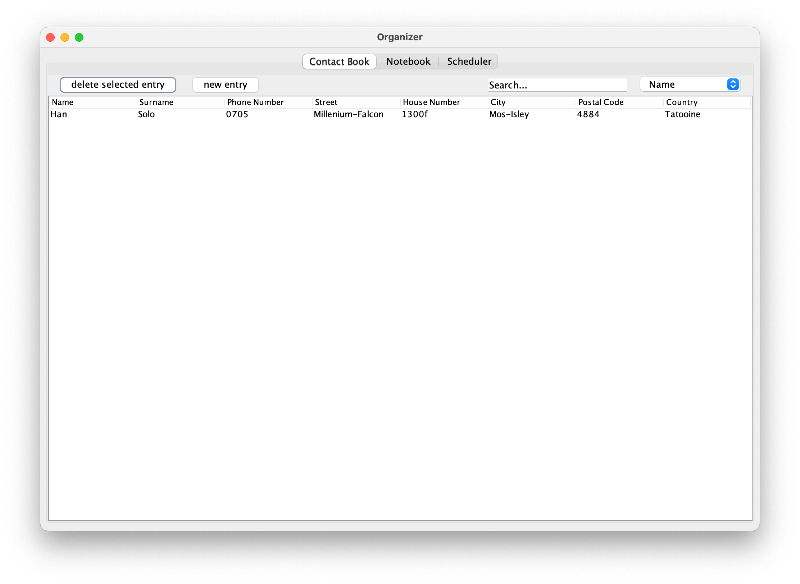
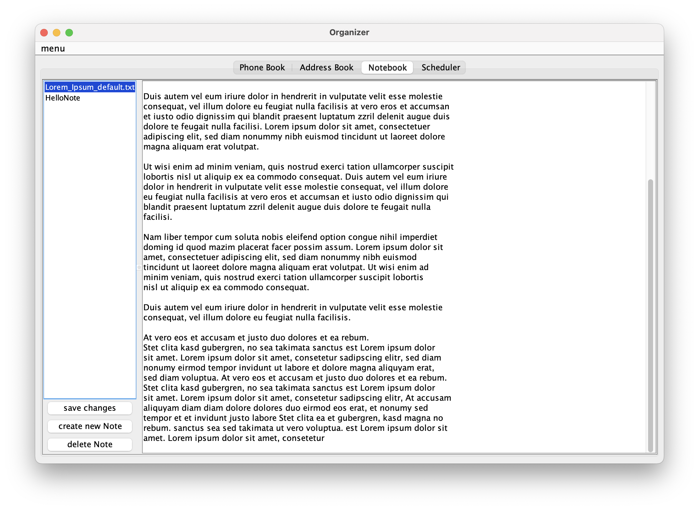
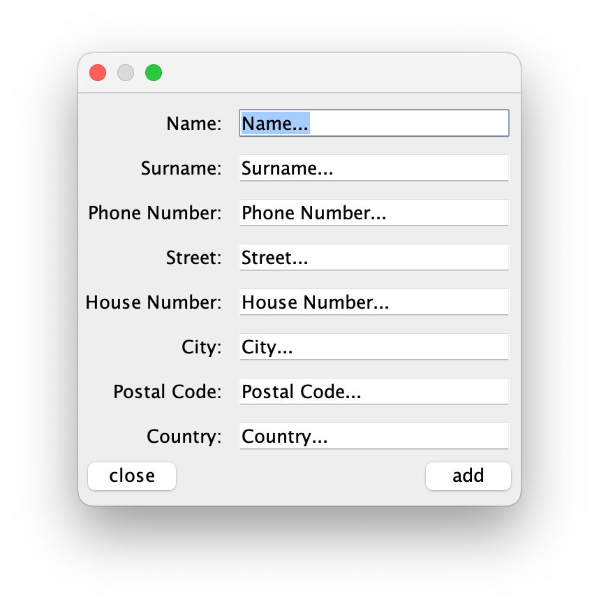
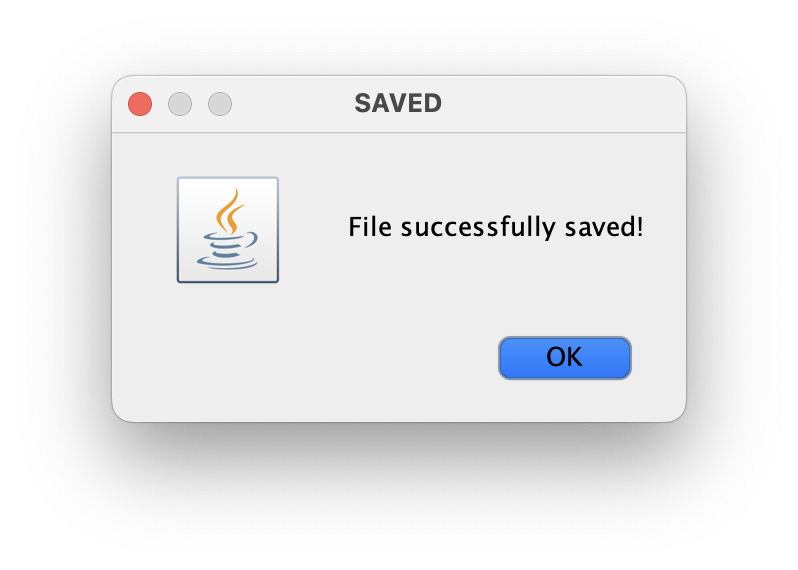
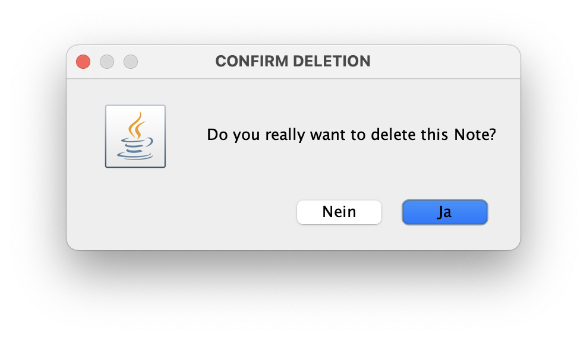
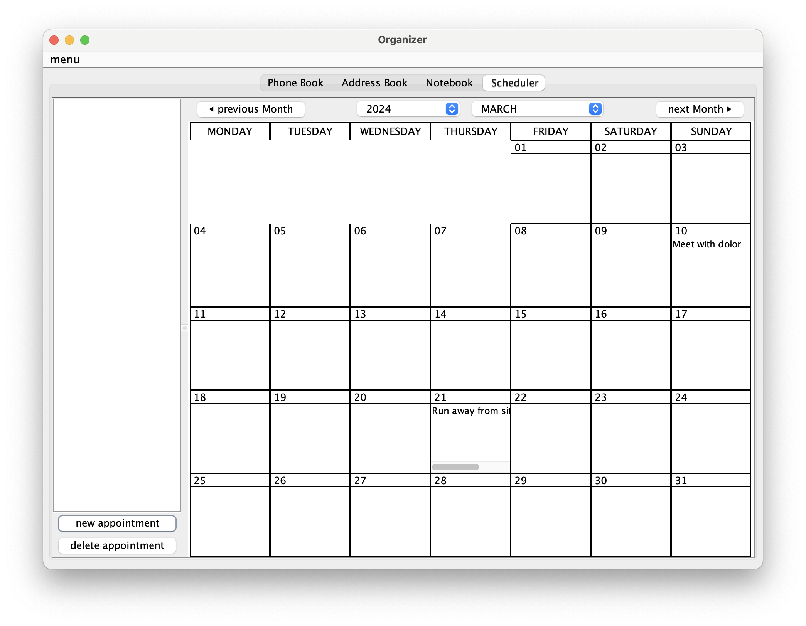
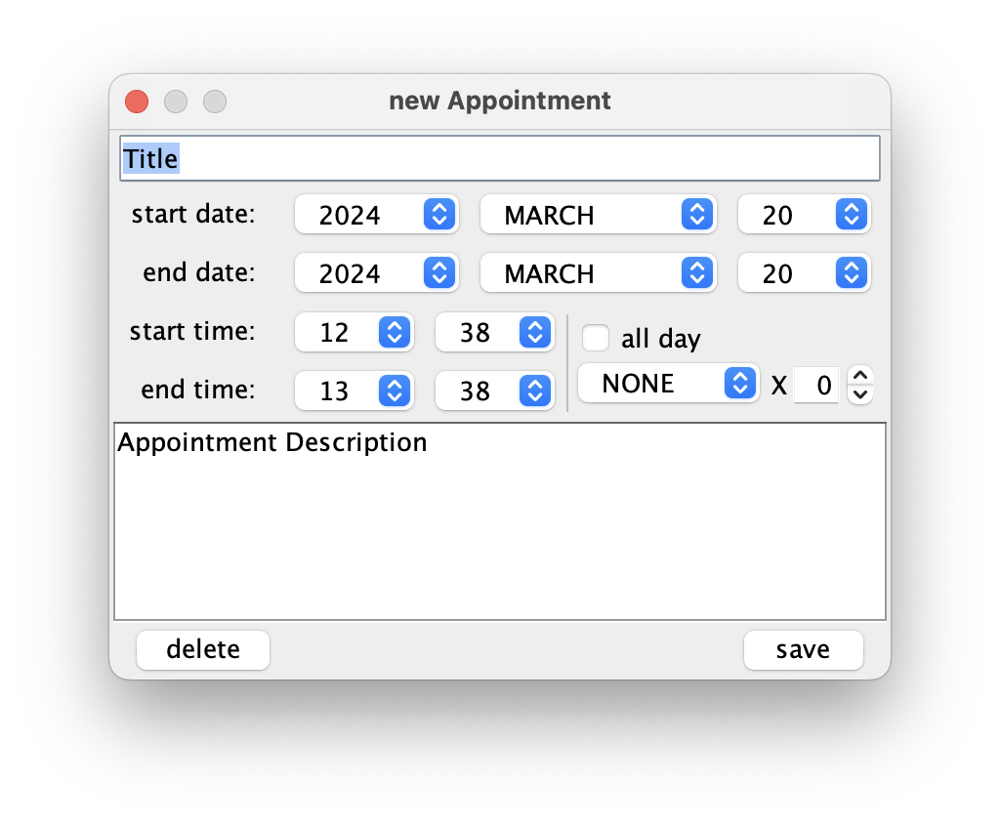

 
 

<h1 style="margin-top: 0px;">Organizer App</h1>

The Organizer-Application consists of 3 subprograms:

<table>
    <tr>
        <td style="text-align: center;"><strong>Contact-Book</strong></td>
        <td style="text-align: center;"><strong>Note-Book</strong></td>
    </tr>
    <tr>
        <td style="text-align: center;"></td>
        <td style="text-align: center;"></td>
    </tr>
    <tr>
        <td rowspan="2" style="text-align: center;"></td>
        <td style="text-align: center;"></td>
    </tr>
    <tr>
        <td style="text-align: center;"></td>
    </tr>
    <tr>
        <td colspan="2" style="text-align: center;"><strong>Scheduler</strong></td>
    </tr>
    <tr>
        <td colspan="2" style="text-align: center;"></td>
    </tr>
    <tr>
        <td colspan="2" style="text-align: center;"></td>
    </tr>
</table>
