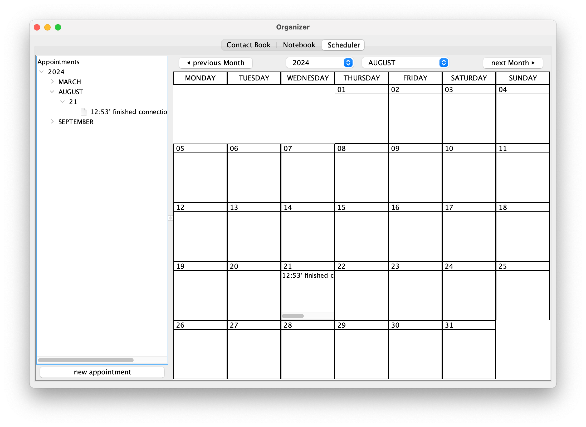

# Organizer-App_Java-swing

The Organizer-Application consists of 4 subprograms:

<table>
    <tr>
        <td>
<strong>Phone-Book</strong>
</td>
        <td>
<strong>Address-Book</strong>
</td>
    </tr>
    <tr>
        <td></td>
        <td></td>
    </tr>
    <tr>
        <td></td>
        <td></td>
    </tr>
    <tr>
        <td>
<strong>Note-Book</strong>
</td>
        <td>
<strong>Scheduler</strong>
</td>
    </tr>
    <tr>
        <td></td>
        <td></td>
    </tr>
    <tr>
        <td></td>
        <td rowspan="2"></td>
    </tr>
    <tr>
        <td>  </td>
    </tr>
</table>
